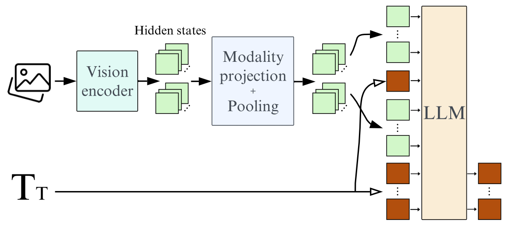
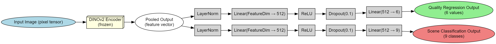

# PicInspector  
📸 AI-Powered Image Quality Analysis Tool  

A multi-modal system that automatically evaluates images through:  
- ✔ Quantitative scoring (Sharpness, Noise, Color, etc.)  
- ✔ Scene understanding (Landscape, Portrait, Night, etc.)  
- ✔ Natural language feedback ("This image has motion blur...")  

---

## Overview

PicInspector is a comprehensive tool for evaluating image quality through AI-driven caption generation and quantitative scoring. This repository contains Jupyter notebooks demonstrating training and inference pipelines for two key components:

- **Caption Generation:** Uses a fine-tuned vision-language model (based on SmolLM) to generate detailed textual descriptions of image quality aspects like sharpness, noise, and overall aesthetics.  
- **Score Generation:** Employs a multi-task model built on DINOv2 to predict numerical scores for quality attributes (e.g., MOS, brightness) and classify scene categories (e.g., landscape, indoor).  

The project leverages datasets like QGround-100K and SPAQ-10K for training and evaluation, including MOS scores, attribute labels, and scene categories. Evaluation includes metrics like ROUGE for captions and loss functions for regression/classification tasks.

**Goals:** Provide an accessible way to assess image quality for applications in photography, content moderation, or AI-assisted editing.

---

## Model Architectures

### 1. Caption Generation Model (Based on Huggingface SmolVLM)

- Fine-tuned vision-language model generating quality descriptions.  
- Processes images with a vision encoder and fuses features into a language model decoder for text generation.  

**Architecture:**  


### 2. Score and Scene Prediction Model (Multi-Head DINOv2)

- Multi-task heads on top of DINOv2 backbone for:  
  - Regression of quality scores (6 numerical outputs)  
  - Classification of scene categories (9 classes)  

**Architecture:**  


---

## Installation

To run the notebooks, install the required dependencies:

```bash
pip install torch transformers accelerate bitsandbytes evaluate rouge_score pandas matplotlib seaborn scikit-learn
```

### Example Inference Workflow
- Load an image (from URL or file).
- Run the caption generation model to get a quality description.
- Run the score prediction model to get numerical quality attributes and scene classification.

Example output:


## Citation

If you use or build upon this project, please consider citing the following works:

```bibtex
@inproceedings{chen2024qground,
    title={Q-Ground: Image Quality Grounding with Large Multi-modality Models}, 
    author={Chen, Chaofeng and Yang, Sensen and Wu, Haoning and Liao, Liang and 
            Zhang, Zicheng and Wang, Annan and Sun, Wenxiu and Yan, Qiong and Lin, Weisi},
    booktitle={ACM International Conference on Multimedia},
    year={2024},
}

@inproceedings{fang2020cvpr,
    title={Perceptual Quality Assessment of Smartphone Photography},
    author={Fang, Yuming and Zhu, Hanwei and Zeng, Yan and Ma, Kede and Wang, Zhou},
    booktitle={IEEE Conference on Computer Vision and Pattern Recognition},
    pages={3677-3686},
    year={2020}
}

@article{marafioti2025smolvlm,
    title={SmolVLM: Redefining small and efficient multimodal models}, 
    author={Andrés Marafioti and Orr Zohar and Miquel Farré and Merve Noyan and Elie Bakouch and Pedro Cuenca and Cyril Zakka and Loubna Ben Allal and Anton Lozhkov and Nouamane Tazi and Vaibhav Srivastav and Joshua Lochner and Hugo Larcher and Mathieu Morlon and Lewis Tunstall and Leandro von Werra and Thomas Wolf},
    journal={arXiv preprint arXiv:2504.05299},
    year={2025}
}

@misc{oquab2023dinov2,
    title={DINOv2: Learning Robust Visual Features without Supervision}, 
    author={Maxime Oquab and Timothée Darcet and Théo Moutakanni and Huy Vo and Marc Szafraniec and Vasil Khalidov and Pierre Fernandez and Daniel Haziza and Francisco Massa and Alaaeldin El-Nouby and Mahmoud Assran and Nicolas Ballas and Wojciech Galuba and Russell Howes and Po-Yao Huang and Shang-Wen Li and Ishan Misra and Michael Rabbat and Vasu Sharma and Gabriel Synnaeve and Hu Xu and Hervé Jegou and Julien Mairal and Patrick Labatut and Armand Joulin and Piotr Bojanowski},
    year={2023},
    eprint={2304.07193},
    archivePrefix={arXiv},
    primaryClass={cs.CV}
}
```
